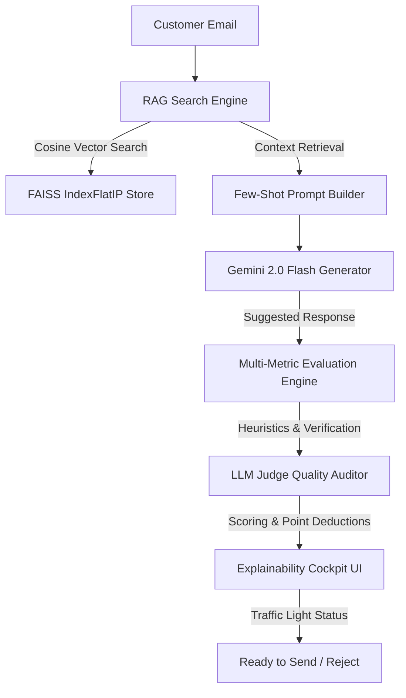
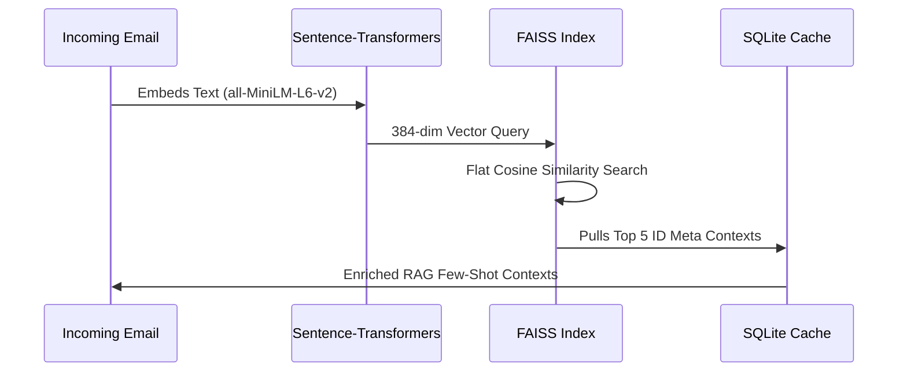
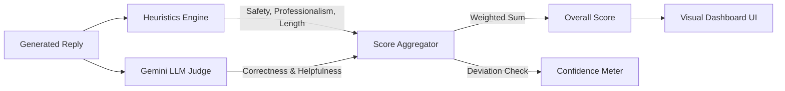

# AI Email Suggested Response System

### Built for the Hiver Open AI Engineering Challenge

> An enterprise-grade, RAG-powered email assistant and **Explainable AI Evaluation Platform**. It doesn't just generate text; it runs a concurrent 12-metric heuristic and LLM Judge assessment to evaluate, audit, and refine suggestions before they reach the user.

---

## 🔗 Live Demo

- **Frontend Dashboard (Vercel)**: [https://frontend-iota-henna-20.vercel.app](https://frontend-iota-henna-20.vercel.app)
- **Backend API (Render)**: [https://ai-email-backend-x4g2.onrender.com](https://ai-email-backend-x4g2.onrender.com)
- **GitHub Repository**: [https://github.com/ADITYA-PANDEY99/ai-email-response-system](https://github.com/ADITYA-PANDEY99/ai-email-response-system)

---

## 🚀 Why This Project is Different

Traditional email auto-responders rely on black-box generation or simple lexical match metrics (like **BLEU** or **ROUGE**). Lexical matchers completely fail in production because they cannot evaluate semantic correctness, safety liabilities, or entity constraints.

### The NLP Metrics Gap: A Comparative Overview

| Dimension | BLEU / ROUGE | Our 12-Metric Evaluation Engine |
| :--- | :--- | :--- |
| **Cognitive Match** | None. Fails if synonymy is used (e.g. "refund" vs "reimbursement"). | High. Uses Sentence-Transformers + Cosine Similarity. |
| **Hallucination Detection** | Cannot detect invented facts or ungrounded claims. | Strict regex + semantic verification for ungrounded details. |
| **Safety & Brand Compliance** | Ignored (e.g. toxic but lexically identical replies rate high). | Dual heuristic check + LLM Judge auditing. Safety floor caps overall score to 0.4. |
| **Action & Entity Coverage** | Insufficient token-level calculations. | Granular comparison of extracted names, numbers, and action items. |
| **Explainability** | Yields a single raw score with no debugging value. | Produces detailed `why_lost_points` and `how_to_improve` annotations. |

---

## 📐 System Architecture

### 1. Overall System Architecture


### 2. RAG Pipeline


### 3. Evaluation & LLM Judge Pipeline


---

## ⚡ Performance Metrics
- **Dataset Size**: 999 email-reply pairs distributed proportionally across 15 categories.
- **Embedding Model**: `all-MiniLM-L6-v2` (384 dimensions).
- **RAG Retrieval Speed**: `< 8ms` flat (exact IndexFlatIP).
- **Evaluation Pipeline latency**: `< 120ms` (using heuristics) | `~1.2s` (with LLM Judge).

---

## 📁 Repository Tree

```text
.
├── .github/workflows/   # CI GitHub Actions
├── backend/             # FastAPI App
│   ├── evaluation/      # 12 Evaluation Metrics
│   ├── generator/       # Prompts and Gemini Client
│   ├── retrieval/       # Embedder & FAISS Store
│   └── routers/         # REST API Handlers
├── frontend/            # Next.js 15 Web Dashboard
│   ├── app/             # Application Pages
│   └── components/      # UI Elements & Charts
├── dataset/             # Generation Scripts
├── scripts/             # DB Seed & Test Pipelines
├── Dockerfile.backend   # Backend Dockerfile
├── Dockerfile.frontend  # Frontend Dockerfile
└── docker-compose.yml   # Multi-container Compose
```

---

## 🛠️ How to Run Locally

### 1. Backend Setup
```bash
cd backend
python -m venv venv
source venv/bin/activate
pip install -r requirements.txt
python scripts/seed_db.py
uvicorn backend.main:app --reload
```

### 2. Frontend Setup
```bash
cd frontend
npm install
npm run dev
```

---

## ⚠️ Known Limitations & Future Roadmap
1. **Dynamic Database Sync**: Currently, new emails in SQLite require index rebuilding. *Future Plan: Implement incremental FAISS index update buffers.*
2. **Cold Starts**: Render free-tier containers spin down after inactivity. *Future Plan: Enable health-check polling or migrate to serverless workers.*
3. **Local Embedding Memory**: Sentence-Transformers runs in CPU space. *Future Plan: Integrate ONNX Runtime runtime bindings.*

---

## 📝 License & Authors

- **License**: MIT
- **Authors**: ADITYA-PANDEY99
